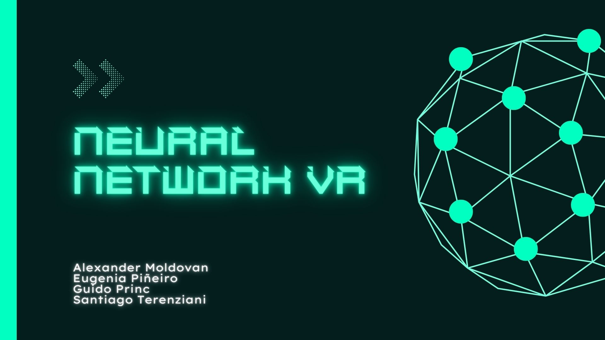
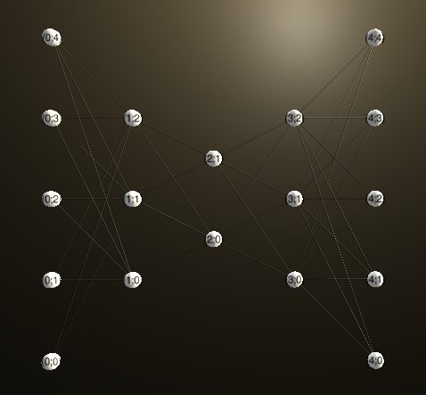
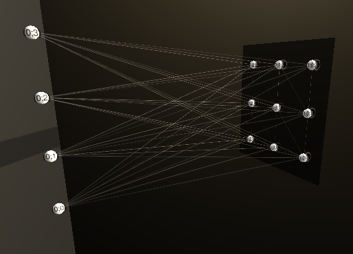
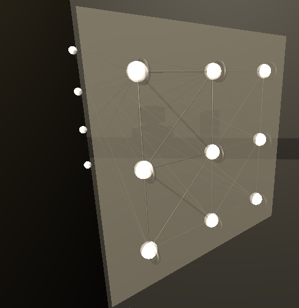
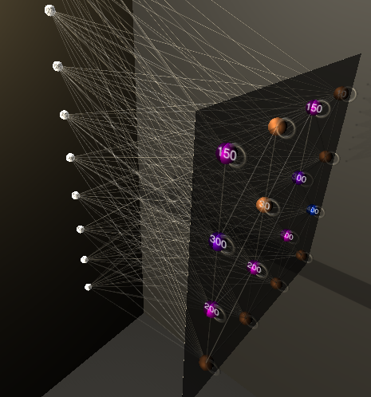

# VR-TP3



Se desarrolló una representación en Realidad Virtual de distintos modelos de Redes Neuronales. 

El objetivo principal del proyecto consiste en que el usuario pueda aprender a distinguir arquitecturas de Redes Neuronales. La visualización en 3D de la totalidad de la red facilita la comprensión de la misma, teniendo en cuenta la cantidad de capas ocultas, la cantidad de neuronas en cada capa, cómo es la capa de salida y cómo son las conexiones entre las neuronas.

Además, se puede aprender de una forma interactiva e inmersiva, lo cual hace al aprendizaje más dinámico y entretenido para el usuario. 

## Modo de Uso 

Se recibe un archivo de configuración `data.json` con las características de la red 

| Parámetro| Descripción                    | Opciones|
| ------------- | ------------------------------ | ------------- |
|"nn_type"     |  Modelo de Red Neuronal  | MLP, KOHONEN, AUTOENCODER |
|"layers"     |  Array donde el índice representa la capa y el valor la cantidad de neuronas en esa capa  | int array |
|"improve_performance"   | Incrementar la performance de generación procedural de neuronas | boolean |
|"show_connections"   | Generar las conexiones de la red. | boolean |


## Ejemplos 

### Perceptron Simple 
Red con 5 neuronas en la capa de entrada y una en la capa de salida.
```json
{
    "nn_type": "MLP",
    "layers": [5, 1],
    "improve_performance": false, 
    "show_connections": true
}
```

### Perceptron Multicapa
Red con 10 neuronas en la capa de entrada, dos capas intermedias con 20 y 30 neuronas respectivamente y 40 neuronas en la capa de salida.
```json
{
    "nn_type": "MLP",
    "layers": [10,20,30,40],
    "improve_performance": false, 
    "show_connections": true
```

### Autoencoder
Red con 10 neuronas en la capa de entrada, dos capas intermedias con 20 y 30 neuronas respectivamente, 2 neuronas en el espacio latente. Luego, la red se genera espejada quedando de la siguiente forma: [5,3,2,3,5]. No es necesario por las capas del Decoder.
```json
{
    "nn_type": "AUTOENCODER",
    "layers": [5,3,2],
    "improve_performance": false, 
    "show_connections": true
}
```


### Kohonen
Para visualizar una Red de Kohonen es necesario configurar más parámetros: 

| Parámetro| Descripción                    | Opciones|
| ------------- | ------------------------------ | ------------- |
|"input_dimension"     |  Cantidad de neuronas en la capa de entrada que representan la dimesión de cada input  | int |
|"grid_dimension"     |  Tamaño de la grilla de la capa de salida. | int |
|"activations" (opcional)    |  String que representa la grilla de la capa de salida. Cada valor es la cantidad de activaciones correspondiente a cada neurona.   | string |


```json
{
    "nn_type": "KOHONEN",
    "layers": [5, 3, 2],
    "kohonen": { 
        "input_dimension": 10,
        "grid_dimension": 3
    },
    "improve_performance": false, 
    "show_connections": true
}
```


En este ejemplo la grilla tiene tamaño 3x3 y se pueden ver la conexiones inhibitorias de las neuronas con ellas mismas y las conexiones con sus vecinas (Se asumió radio R=1)


Las activaciones se muestran por colores formando un heatmap en la capa de salida. 

```json
{
    "nn_type": "KOHONEN",
    "layers": [5, 3, 2],
    "kohonen": { 
        "input_dimension": 10,
        "grid_dimension": 4, 
        "activations": "[[100, 200, 300, 150],[100, 200, 30, 40],[100, 200, 300, 150],[50, 400, 30, 10 ]]"
    },
    "improve_performance": false, 
    "show_connections": true
}
```


## Interacción con Teclas
- W: Trasladar la red hacia arriba 
- A: Trasladar  la red hacia la izquierda 
- S: Trasladar  la red hacia abajo
- D: Trasladar  la red hacia la derecha 

- Flechas: Rotar la red respecto de su centro 

- L: Mostrar y ocultar las etiquetas de cada neurona